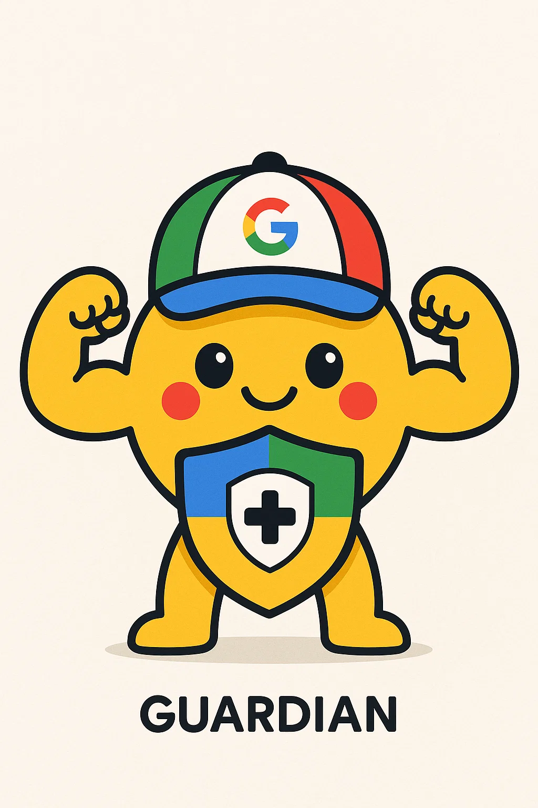

🛡️ Guardian AI
Your Personal Multimodal Guardian — Powered by Google Gemma 3n

  

🚀 The Story Begins: A Thought, A Promise, A Guardian
You started with a vision: AI that truly understands, privately and on-device. In a world of cloud-first AI, Guardian AI flips the script.
It listens (audio), sees (images), converses (text)—and all decisions, emotional cue detection, and emergency actions are made exclusively by Gemma 3n, never outsourced.

While Whisper and BLIP from Hugging Face handle transcription and image captioning, Gemma 3n remains the ultimate arbiter. It ingests those processed inputs and decides: respond, nudge, or notify contacts—all under its holistic judgment framework.

🔍 Why This Problem, Why Now
Privacy-first imperative: Gemma 3n works entirely offline, so sensitive user data—voice, photos, thoughts—never leave the device.
Multimodal synergy: Only Gemma 3n combines audio, image, and text in one unified model—communicating context-aware assistance without cloud delays.
Edge-ready intelligence: Designed for real-life hardware (E2B runs on ~2 GB RAM), demonstrating the true power of on-device AI.

In short: Gemma 3n is the brain; Whisper and BLIP are just its sensory organs.

🧠 Core Architecture & Decision Flow

1. Preprocessing Stage
Audio: Uploaded audio is transcribed via WhisperProcessor + WhisperForConditionalGeneration.

Image: Uploaded images are described via BlipProcessor + BlipForConditionalGeneration.

2. Decision Stage
All processed assets are then sent to Gemma 3n via GuardianAI.chat() as unified prompts.

Gemma 3n parses inputs, assesses emotional tone, urgency, and context, and outputs structured JSON reflecting:

"Action": e.g. "nudge" or "emergency_contact"

"Risk", "Analysis"

3. User Empowered Control
If a critical action is recommended, it surfaces a confirmation prompt in UI.

Only upon user consent does the app send formatted alerts to emergency contacts.

Gemma 3n is kept deliberately separate from the Whisper/BLIP modules—it never delegates decisions to them. They simply feed descriptors to Gemma 3n, which remains in full control.

✨ Hero Features
Unified Multimodal Input: Text, audio, and images flow into one conversation feed.

Gemma 3n as the Mind: All interpretation, emotional assessment, risk detection, and action planning are powered by Gemma 3n.

Resilient, Private, On‑Device: No need for internet—or trust in remote servers.

Empowered User Confirmations: Emergency alerts are never sent without explicit user agreement.

Stylish & Accessible UI: Dark theme, chat bubbles, alert boxes, thoughtful visuals—all in Streamlit.
